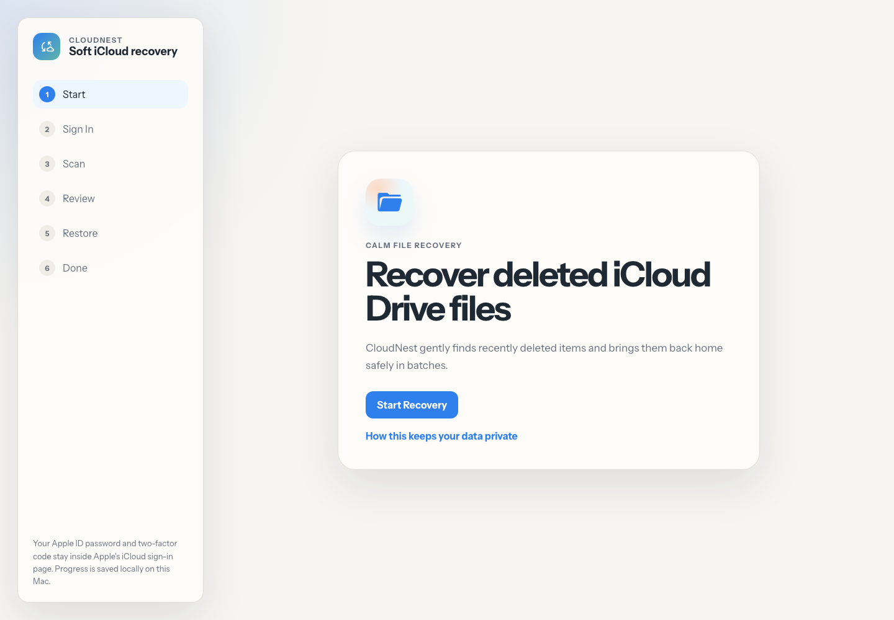

# CloudNest

CloudNest is a cute, calm macOS app for recovering deleted iCloud Drive files when iCloud.com becomes unreliable.

It is built with Tauri 2, a vanilla Vite frontend, and a Rust-native restore core.



The UI uses bundled Google font files: `Instrument Sans` for the product interface and `IBM Plex Mono` for technical logs. Icons use Google's `Material Symbols Rounded` font locally, so they render inside the packaged app without loading assets from a CDN.

## What It Does

- Opens Chrome for Apple-managed iCloud sign-in.
- Captures the temporary iCloud recovery session from Chrome DevTools Protocol.
- Scans recently deleted iCloud Drive items.
- Restores items in safe batches with retry and resume support.
- Saves progress locally without writing Apple credentials to disk.

## Development

```bash
npm install
npm run tauri -- dev
```

## Build

```bash
npm run build
npm run tauri -- build
```

The macOS app and DMG are created under Tauri's release bundle output.

## Tests

```bash
cd src-tauri
cargo test
```

The Rust test suite covers restore batching, checkpoint integrity, auth URL parsing, cookie extraction, cancellation, and resume behavior.

## Visual QA

The welcome screen above was captured from the production Vite build with local Chrome headless.

## Privacy

Your Apple ID password and two-factor code stay inside Apple's iCloud sign-in page. Session credentials are kept in memory only and are not written to disk.
